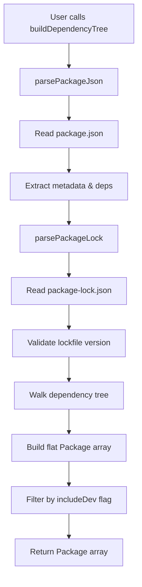
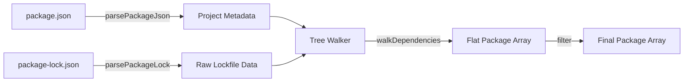
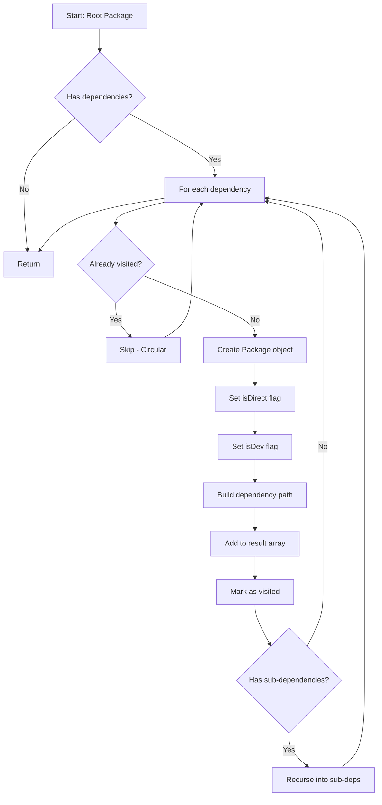
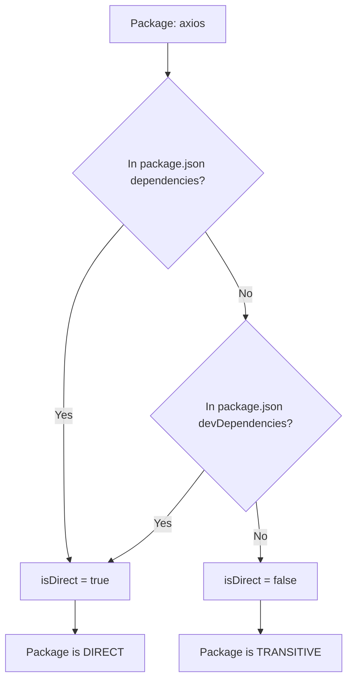
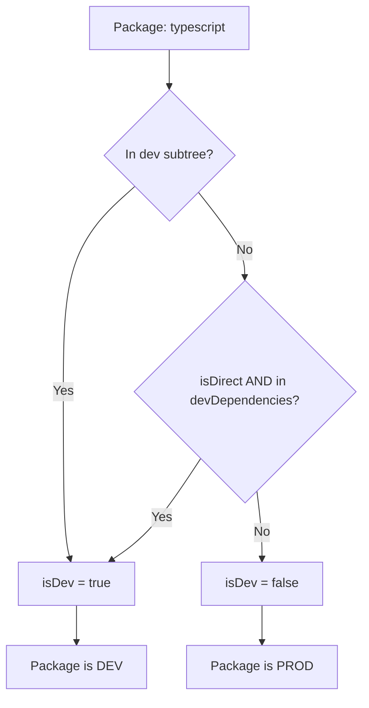
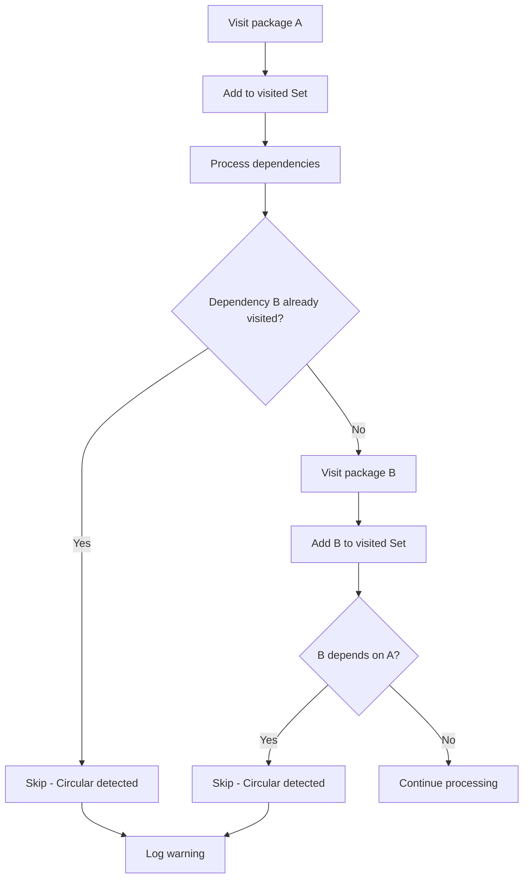
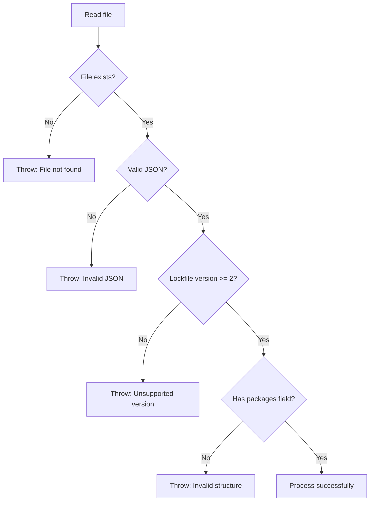

# Parsers Module Architecture

## High-Level Flow



## Data Flow



## Package-lock.json Structure (v3)

```
{
  "name": "supplyshield",
  "version": "0.1.0",
  "lockfileVersion": 3,
  "packages": {
    "": {                                    // Root package
      "name": "supplyshield",
      "version": "0.1.0",
      "dependencies": { ... },
      "devDependencies": { ... }
    },
    "node_modules/axios": {                  // Direct dependency
      "version": "1.16.0",
      "resolved": "https://...",
      "integrity": "sha512-...",
      "license": "MIT",
      "dependencies": {
        "follow-redirects": "^1.16.0"
      }
    },
    "node_modules/follow-redirects": {       // Transitive dependency
      "version": "1.16.0",
      "resolved": "https://...",
      "integrity": "sha512-...",
      "license": "MIT"
    }
  }
}
```

## Tree Walking Algorithm



## Package Object Construction

```
Input: Lockfile Entry
├─ name: "axios"
├─ version: "1.16.0"
├─ resolved: "https://registry.npmjs.org/axios/-/axios-1.16.0.tgz"
├─ integrity: "sha512-..."
├─ license: "MIT"
└─ dependencies: { "follow-redirects": "^1.16.0" }

Context:
├─ currentPath: ["supplyshield"]
├─ isDevSubtree: false
├─ directDeps: Set(["axios", "chalk", ...])
└─ directDevDeps: Set(["typescript", "tsx", ...])

Output: Package Object
{
  name: "axios",
  version: "1.16.0",
  isDev: false,                              // Not in dev subtree
  isDirect: true,                            // In directDeps set
  path: ["supplyshield", "axios"],           // Built from currentPath
  license: "MIT",
  resolved: "https://registry.npmjs.org/axios/-/axios-1.16.0.tgz",
  integrity: "sha512-..."
}
```

## Direct vs Transitive Detection



## Prod vs Dev Detection



## Edge Case: Package in Both Trees

```
Scenario: "chalk" appears in both prod and dev dependency chains

Tree Walk 1 (Production):
supplyshield → axios → chalk
Result: Package { name: "chalk", isDev: false, path: ["supplyshield", "axios", "chalk"] }

Tree Walk 2 (Development):
supplyshield → typescript → chalk
Result: Package { name: "chalk", isDev: true, path: ["supplyshield", "typescript", "chalk"] }

Final Array: TWO separate Package objects with different paths
```

## Circular Dependency Detection



## Error Handling Flow



## Output Format Example

```typescript
[
  {
    name: "supplyshield",
    version: "0.1.0",
    isDev: false,
    isDirect: true,
    path: ["supplyshield"],
    license: "MIT",
    resolved: undefined,
    integrity: undefined
  },
  {
    name: "axios",
    version: "1.16.0",
    isDev: false,
    isDirect: true,
    path: ["supplyshield", "axios"],
    license: "MIT",
    resolved: "https://registry.npmjs.org/axios/-/axios-1.16.0.tgz",
    integrity: "sha512-6hp5CwvTPlN2A31g5dxnwAX0orzM7pmCRDLnZSX772mv8WDqICwFjowHuPs04Mc8deIld1+ejhtaMn5vp6b+1w=="
  },
  {
    name: "follow-redirects",
    version: "1.16.0",
    isDev: false,
    isDirect: false,
    path: ["supplyshield", "axios", "follow-redirects"],
    license: "MIT",
    resolved: "https://registry.npmjs.org/follow-redirects/-/follow-redirects-1.16.0.tgz",
    integrity: "sha512-..."
  },
  {
    name: "typescript",
    version: "5.4.5",
    isDev: true,
    isDirect: true,
    path: ["supplyshield", "typescript"],
    license: "Apache-2.0",
    resolved: "https://registry.npmjs.org/typescript/-/typescript-5.4.5.tgz",
    integrity: "sha512-..."
  }
]
```

## Performance Considerations

- **Memory**: Flat array is memory-efficient vs nested tree
- **Lookup**: Use Set for O(1) direct dependency checks
- **Deduplication**: Track visited packages to avoid processing duplicates
- **Lazy Loading**: Only parse files when needed
- **Streaming**: For very large lockfiles, consider streaming JSON parser

## Integration Points

```mermaid
graph LR
    A[Parsers Module] --> B[SBOM Generator]
    A --> C[Vulnerability Scanner]
    A --> D[Reachability Analyzer]
    A --> E[Risk Calculator]
    
    B --> F[Uses: name, version, license]
    C --> G[Uses: name, version, isDirect]
    D --> H[Uses: name, path, isDev]
    E --> I[Uses: all fields]