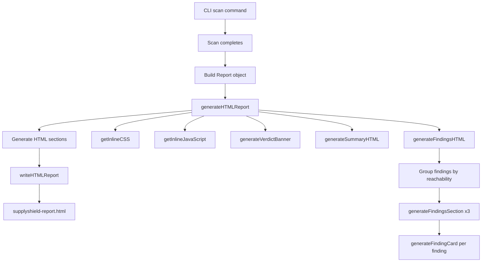
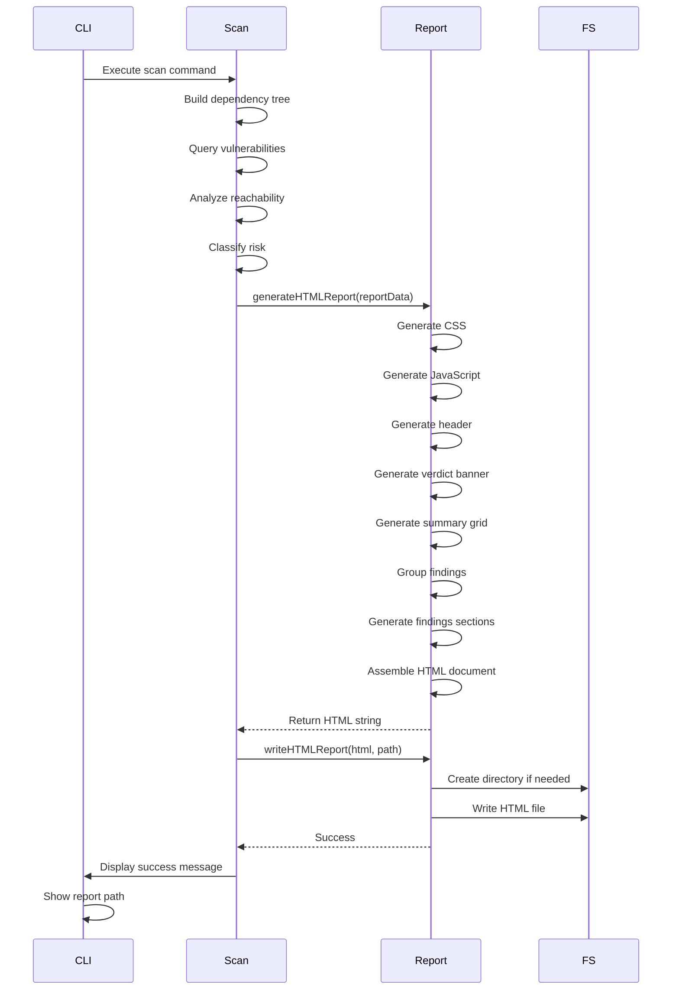

# HTML Report Architecture

## Report Generation Flow



## HTML Document Structure

```
<!DOCTYPE html>
<html>
  <head>
    <meta charset="UTF-8">
    <title>SupplyShield Security Report</title>
    <style>
      /* Inline CSS - Dark theme */
      /* ~500 lines of CSS */
    </style>
  </head>
  <body>
    <div class="container">
      
      <!-- 1. HEADER -->
      <header class="report-header">
        <h1>🛡️ SupplyShield</h1>
        <div>Project metadata</div>
        <div>Powered by IBM Bob</div>
      </header>
      
      <!-- 2. VERDICT BANNER -->
      <div class="verdict-banner safe|warning">
        <div class="verdict-icon">✓|⚠</div>
        <div class="verdict-text">
          <h2>Status message</h2>
          <p>Description</p>
        </div>
      </div>
      
      <!-- 3. SUMMARY GRID -->
      <section class="summary">
        <h2>Summary Statistics</h2>
        <div class="summary-grid">
          <div class="summary-card">Total Packages</div>
          <div class="summary-card">Total Vulnerabilities</div>
          <div class="summary-card">Reachable</div>
          <div class="summary-card">Unreachable</div>
          <div class="summary-card">Dev-Only</div>
          <div class="summary-card">Priority Breakdown</div>
        </div>
      </section>
      
      <!-- 4. FINDINGS SECTIONS -->
      <section class="findings">
        <h2>Findings</h2>
        
        <!-- 4a. Reachable (expanded) -->
        <div class="findings-section" id="reachable">
          <h3 onclick="toggleSection('reachable')">
            <span class="toggle-icon">▼</span>
            Reachable Vulnerabilities (X)
          </h3>
          <div class="section-content">
            <!-- Finding cards -->
            <div class="finding-card critical" id="finding-GHSA-xxx">
              <div class="finding-header">
                <span class="severity-badge">CRITICAL</span>
                <a href="..." class="advisory-link">GHSA-xxx</a>
                <span>in package@version</span>
              </div>
              <div class="finding-summary">Summary text</div>
              <button onclick="toggleFinding('finding-GHSA-xxx')">
                Show details
              </button>
              <div class="finding-details" style="display:none">
                <div>Full advisory</div>
                <div>Imported in files</div>
                <div>Recommendation</div>
                <div>References</div>
              </div>
            </div>
            <!-- More finding cards... -->
          </div>
        </div>
        
        <!-- 4b. Unreachable (collapsed) -->
        <div class="findings-section collapsed" id="unreachable">
          <h3 onclick="toggleSection('unreachable')">
            <span class="toggle-icon">▶</span>
            Unreachable in Production (X)
          </h3>
          <div class="section-content">
            <!-- Finding cards -->
          </div>
        </div>
        
        <!-- 4c. Dev-only (collapsed) -->
        <div class="findings-section collapsed" id="dev-only">
          <h3 onclick="toggleSection('dev-only')">
            <span class="toggle-icon">▶</span>
            Dev-Only Dependencies (X)
          </h3>
          <div class="section-content">
            <!-- Finding cards -->
          </div>
        </div>
      </section>
      
      <!-- 5. FOOTER -->
      <footer class="report-footer">
        <div class="footer-disclaimer">Disclaimer text</div>
        <div class="footer-meta">Generated by...</div>
      </footer>
      
    </div>
    
    <script>
      /* Inline JavaScript */
      function toggleSection(sectionId) { /* ... */ }
      function toggleFinding(findingId) { /* ... */ }
    </script>
  </body>
</html>
```

## Component Hierarchy

```
generateHTMLReport(report: Report): string
├── getInlineCSS(): string
│   ├── Base styles (body, container, typography)
│   ├── Header styles
│   ├── Verdict banner styles (safe/warning variants)
│   ├── Summary grid styles (6-card layout)
│   ├── Findings section styles (collapsible)
│   ├── Finding card styles (expandable)
│   ├── Severity badge styles (critical/high/medium/low)
│   ├── Button and link styles
│   └── Footer styles
│
├── getInlineJavaScript(): string
│   ├── toggleSection(sectionId)
│   └── toggleFinding(findingId)
│
├── Header HTML
│   ├── Logo/title
│   ├── Project metadata
│   └── "Powered by IBM Bob"
│
├── generateVerdictBanner(summary): string
│   ├── Calculate reachable count
│   ├── Determine safe/warning status
│   └── Return banner HTML
│
├── generateSummaryHTML(summary): string
│   ├── Total packages card
│   ├── Total vulnerabilities card
│   ├── Reachable card
│   ├── Unreachable card
│   ├── Dev-only card
│   └── Priority breakdown card
│
├── generateFindingsHTML(findings): string
│   ├── Group findings by reachability
│   │   ├── reachable[] (CRITICAL_REACHABLE, HIGH_REACHABLE, etc.)
│   │   ├── unreachable[] (*_UNREACHABLE)
│   │   └── devOnly[] (DEV_ONLY)
│   │
│   ├── generateFindingsSection("Reachable", reachable, false)
│   │   └── findings.map(generateFindingCard)
│   │
│   ├── generateFindingsSection("Unreachable", unreachable, true)
│   │   └── findings.map(generateFindingCard)
│   │
│   └── generateFindingsSection("Dev-Only", devOnly, true)
│       └── findings.map(generateFindingCard)
│
├── generateFindingCard(finding): string
│   ├── Severity badge
│   ├── Advisory link (GHSA/CVE)
│   ├── Package info
│   ├── Summary (always visible)
│   ├── Expand button
│   └── Details section (hidden by default)
│       ├── Full advisory
│       ├── Imported in files
│       ├── Recommendation
│       └── References
│
└── Footer HTML
    ├── Disclaimer
    └── Generation metadata
```

## Data Flow



## Color Palette

```
Dark Theme Colors:
┌─────────────────────────────────────────┐
│ Background:     #0d1117 ████████████    │
│ Card BG:        #161b22 ████████████    │
│ Border:         #30363d ████████████    │
│ Primary Text:   #c9d1d9 ████████████    │
│ Secondary Text: #8b949e ████████████    │
│                                         │
│ Severity Colors:                        │
│ Critical:       #f85149 ████████████    │
│ High:           #d29922 ████████████    │
│ Medium:         #d4a72c ████████████    │
│ Low:            #8b949e ████████████    │
│ Success:        #3fb950 ████████████    │
└─────────────────────────────────────────┘
```

## Interactive Elements

### Collapsible Sections
```javascript
// Click section header to toggle
toggleSection('reachable')
  → Remove/add 'collapsed' class
  → Change toggle icon (▼/▶)
  → Show/hide section-content
```

### Expandable Finding Cards
```javascript
// Click "Show details" button
toggleFinding('finding-GHSA-xxx')
  → Toggle finding-details display
  → Change button text (Show/Hide)
  → Change expand icon (▶/▼)
  → Add/remove 'expanded' class
```

## File Size Considerations

Estimated sizes:
- CSS: ~15-20 KB (minified inline)
- JavaScript: ~1-2 KB (minified inline)
- HTML structure: ~5-10 KB base
- Content (per finding): ~1-2 KB

Total for typical report (50 findings):
- ~100-150 KB (reasonable for single file)
- Gzips well for sharing
- Opens instantly in browser

## Browser Compatibility

Target browsers:
- ✅ Chrome/Edge (latest)
- ✅ Firefox (latest)
- ✅ Safari (latest)
- ✅ Mobile browsers

No dependencies on:
- ❌ External CSS frameworks
- ❌ JavaScript libraries
- ❌ Web fonts
- ❌ External images
- ❌ CDN resources

## Accessibility Features

- Semantic HTML5 elements
- Proper heading hierarchy (h1 → h2 → h3 → h4)
- ARIA labels for interactive elements
- Keyboard navigation support
- High contrast colors (WCAG AA compliant)
- Focus indicators on interactive elements